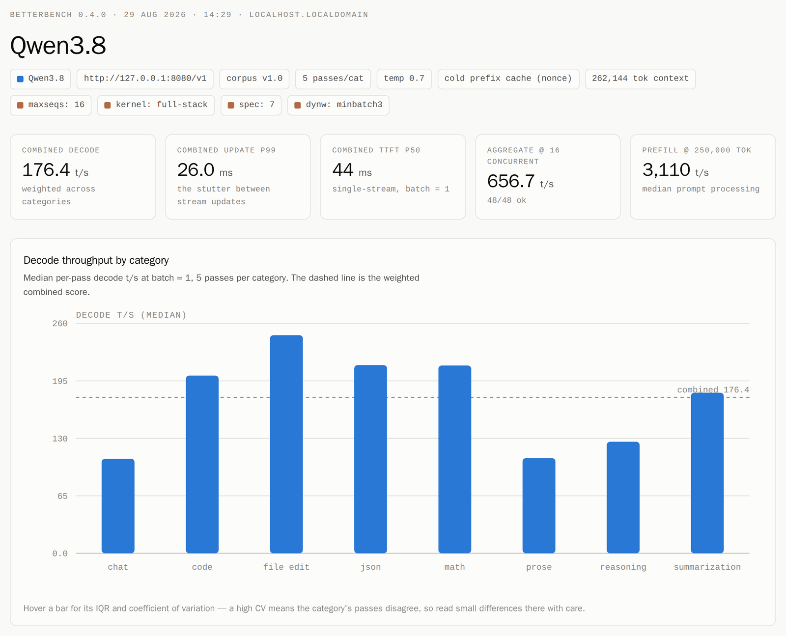
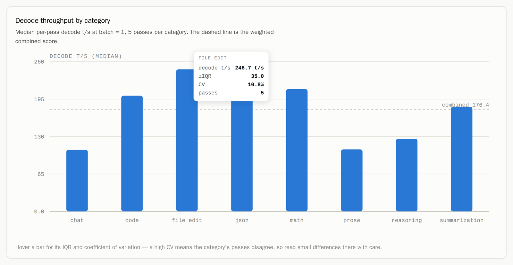
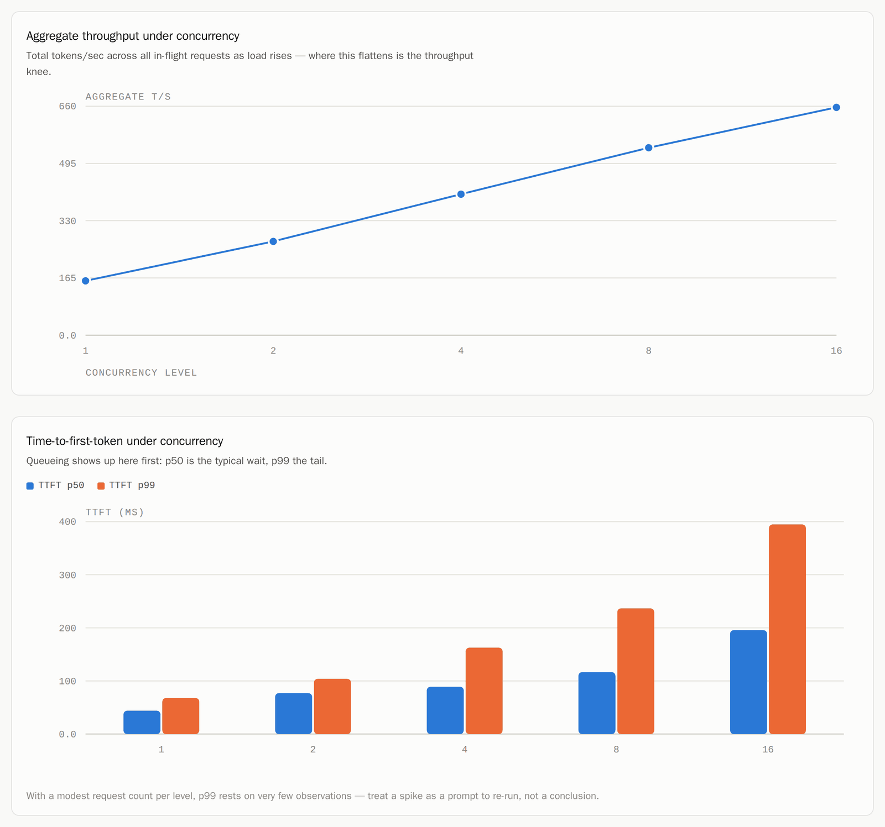
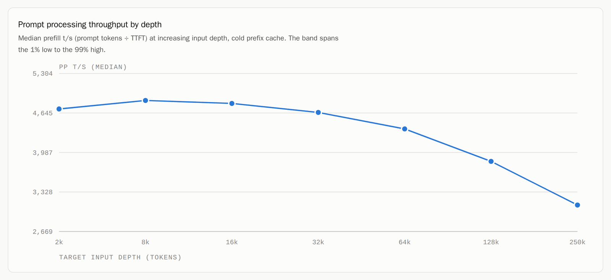
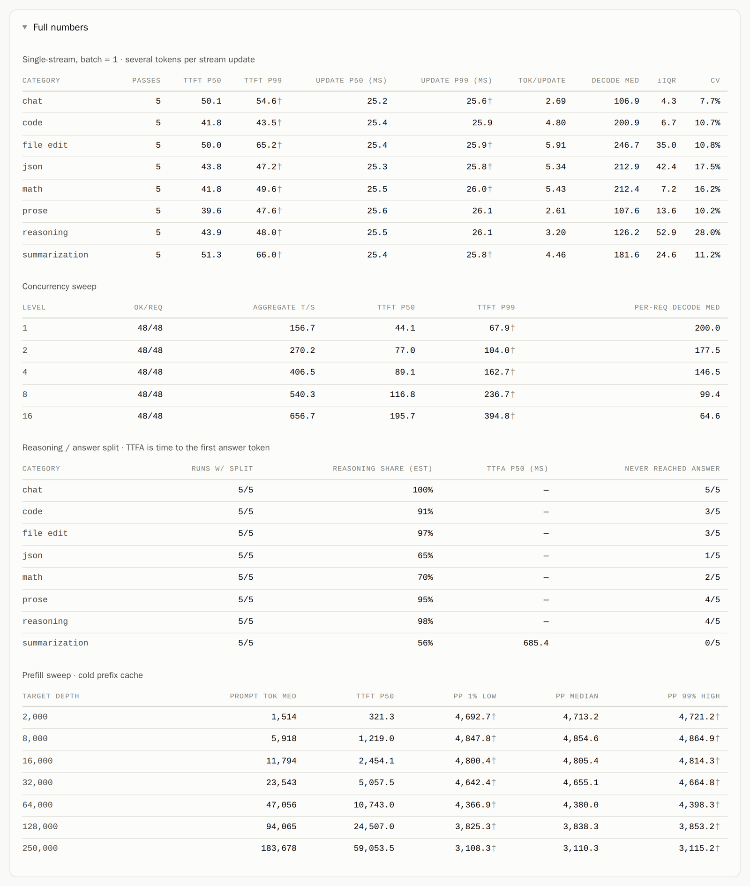
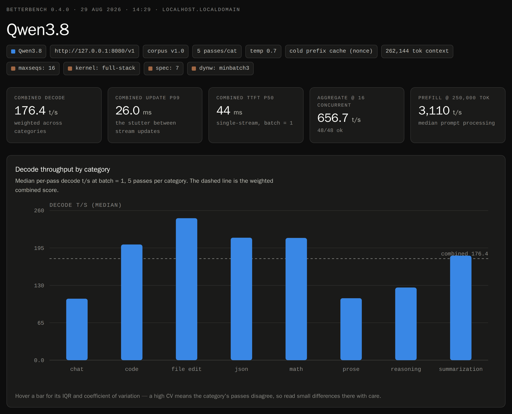

# BetterBench

A real-world, percentile-based benchmark for LLM inference servers. Point it at any
**OpenAI-compatible `/v1` endpoint** (vLLM, llama.cpp server, SGLang, TGI, Ollama, LM Studio, …)
and it measures how the stack *actually feels* across representative task categories —
prose, reasoning, math, code, JSON, file-edits, summarization, chat — not synthetic filler.

Unlike most tools that print one average tokens/sec at batch=1, BetterBench reports the
**distribution** (1% low / median / average / 99% high) for three layers — time-to-first-token,
inter-token latency, and per-run throughput — and is engineered to **resolve ~1% differences**
through paired, drift-cancelled A/B measurement.

Every run also writes a **self-contained HTML report** beside its `results.json` — headline
tiles, charts and the full tables in one file with no network assets, so it opens offline and
travels in an email.

<p align="center">
  
</p>

**[→ Open the example report](https://htmlpreview.github.io/?https://github.com/GGZ14/BetterBench/blob/main/docs/example-report.html)**
&nbsp;·&nbsp; more screenshots in [The HTML report](#the-html-report)

## Install

```bash
pip install -e .          # editable install works out of the box; needs Python 3.10+, stdlib + numpy only
```

## Quickstart

```bash
# Benchmark one endpoint (single-stream, prefill and concurrency sweeps).
# Without --out the result lands in a versioned run directory under
# ~/.betterbench/runs/ — see [Where runs live](#where-runs-live)
betterbench run --endpoint http://192.168.12.47:8080/v1 --model Qwen3.8

# …or keep it in a specific place — an explicit --out always wins
betterbench run --endpoint http://192.168.12.47:8080/v1 --model Qwen3.8 \
                --out results/radiance-27b.json

# A gateway in front of the server wants a Bearer key
betterbench run --endpoint https://gateway.internal/v1 --model qwen3-8 \
                --api-key "$GATEWAY_KEY"            # or export BETTERBENCH_API_KEY

# Re-render a saved result later (markdown to stdout, or a charted HTML page)
betterbench report results/radiance-27b.json
betterbench report results/radiance-27b.json --html

# Run just one phase — decode, prompt processing, or the concurrency sweep
betterbench run --endpoint http://192.168.12.47:8080/v1 --model Qwen3.8 --prefill
betterbench run --endpoint http://192.168.12.47:8080/v1 --model Qwen3.8 --decode --concurrency

# Choose how many measured passes per category (default 20), or take the 5-pass shortcut
betterbench run --endpoint http://192.168.12.47:8080/v1 --model Qwen3.8 --passes 10
betterbench run --endpoint http://192.168.12.47:8080/v1 --model Qwen3.8 --quick

# Record what the run actually was, so two results can be compared later
betterbench run --endpoint http://192.168.12.47:8080/v1 --model Qwen3.8 \
                --note image=v0.9.3 --note quant=mxfp4 --note kv=fp8 --note tp=2

# Rigorous paired A/B between two endpoints (e.g. two images on ports 8080/8081)
betterbench ab --endpoint-a http://host:8080/v1 --endpoint-b http://host:8081/v1 \
               --model Qwen3.8 --mde 1.0
```

## Where runs live

Without `--out`, a run writes into its **own versioned directory** under
`~/.betterbench/runs/` (`$BETTERBENCH_HOME/runs/` when that variable is set) —
nothing lands in the directory you ran it from (unless `$BETTERBENCH_HOME`
itself is a relative path — one-time stderr warning if so), and re-running
can never overwrite an earlier result:

```bash
betterbench run --endpoint ... --model Qwen3.8 --name mxfp4-flip
# output: ~/.betterbench/runs/20260211-091234-mxfp4-flip/
ls ~/.betterbench/runs/
#    20260211-091234-qwen3-8/  20260211-110402-qwen3-8-2/  20260212-080101-mxfp4-flip/  ...
```

The directory name is a start timestamp plus a label — the model name by
default, `--name mxfp4-flip` to call a run what it is — so entries sort by time
and `ls` reads like a changelog. A second run in the same second appends `-2`;
collisions never clobber. The directory is created before the measuring starts
and its path printed in the opening banner, so a run knows where it is going
before it spends the hours getting there. A run directory holds that run's `results.json` and
the charted HTML report beside it, and `ab` writes its `ab.json` the same way,
so history accumulates instead of churning:

```bash
betterbench report ~/.betterbench/runs/20260211-091234-qwen3-8/results.json --html
```

`--out PATH` always wins over the default, and `BETTERBENCH_HOME` moves the
base directory. (`betterbench report`/`compare` read whatever path you point
them at and write nothing unless told to.)

## Authentication

A request goes out unauthorised by default — right for a local vLLM or
llama.cpp server, but wrong once a gateway sits in front of the endpoint.
`--api-key` sends the key as `Authorization: Bearer KEY` on every request,
including the `/v1/models` context probe, which would otherwise 401 and read
as "unknown max context":

```bash
betterbench run --endpoint https://gateway.internal/v1 --model qwen3-8 --api-key "..."

# A/B boxes behind two gateways get per-endpoint keys
betterbench ab --endpoint-a https://a.internal/v1 --endpoint-b https://b.internal/v1 \
               --model qwen3.8 --api-key-a "$KEY_A" --api-key-b "$KEY_B"
```

The key travels on the wire only: it is never written into the results, so a
`results.json` stays shareable however it was produced. `export
BETTERBENCH_API_KEY=...` fills in for any missing key flag, keeping it out of
history where the flag would otherwise live.

## Staying current

BetterBench checks once a day whether a newer release has been tagged, and
prints a line after the run if so — a benchmark a version behind can be
measuring something the current release already fixed:

```
A newer BetterBench is available: v0.7.0 (running 0.6.0) — https://github.com/GGZ14/BetterBench/releases
```

The check runs on a background thread and is finished **before the first
measured request**, so it is never on the wire while a request to the endpoint
under test is being timed. Its answer is cached in
`$BETTERBENCH_HOME/update-check.json` for 24 hours, so the ordinary invocation
makes no network call at all, and every failure — offline, proxied, rate
limited — is silence rather than an error. Switch it off with
`--no-update-check` on any subcommand, or `BETTERBENCH_NO_UPDATE_CHECK=1`.

## What you get

**Single-stream table** — per category: TTFT p50/p99, decode t/s median ± IQR, a weighted
combined score, and a latency pair that depends on what the server actually streams:

- **one token per update** — ITL as tokens/sec (1% low = slowest tokens / median / 99% high
  = fastest), exactly as before;
- **several tokens per update** (speculative decoding — MTP, EAGLE, Medusa, n-gram,
  DFlash2) — `update p50 / p99 (ms)` and `tok/update` instead. Tokens that arrive together
  in one network write have no time *between* them, so BetterBench reports the gap it
  measured rather than inventing a per-token number. p99 is the stutter.

**Reasoning / answer split** — on a thinking model, TTFT is time to the first *thinking*
token, a wait nobody experiences. Where the split is detectable, the report adds the
reasoning share and **TTFA** — time to the first *answer* token — always with the `k/N` runs
it was computed over. A run cut off before `</think>` is recorded as `unknown`, not as an
answer.

**Prompt-processing (prefill) sweep** — prefill throughput (prompt tokens ÷ TTFT) at
increasing input depth (2K → 64K), with a cold prefix cache and tiny decode, so you see how
prompt processing scales for long-context / RAG / big-file workloads. This sweep is the only
place BetterBench reports prefill throughput: on the short prompts of the single-stream
corpus, TTFT is mostly fixed per-request overhead rather than prefill work, so a per-category
`PP t/s` understates the real figure by more than 2x. That column is gone.

**Run length you control** — `--passes N` sets the measured passes per category (default 20)
and `--warmup N` the discarded ones; both override whatever a `--config` file says. `--quick`
is the shorthand for a smoke run — 5 passes after 1 warmup — for checking that an endpoint,
model name and corpus are wired up before you spend an hour on the real thing. Five passes
is too thin a sample to publish or to compare stacks with; the pass count is printed in the
banner and recorded in the report so a quick result can't be mistaken for a full one.

**Concurrency sweep** — aggregate throughput and per-request TTFT/decode percentiles at
increasing load, revealing the throughput/latency knee. Levels 1, 2, 4 and 8 by default;
deeper is a `--config` file away (`"concurrency_levels": [1, 2, 4, 8, 16, 32]`), and
each extra level costs its own pass of `concurrency_requests`.

**Phases you can run one at a time** — `--decode` (single-stream, batch = 1), `--prefill`
(the prompt-processing depth sweep) and `--concurrency` (the load sweep). Naming a phase runs
only the phases named, so re-measuring prompt processing after a kernel change costs the
prefill sweep and nothing else; name several to run several. With none named all three run,
as before. `--prefill` reads no corpus — the sweep builds its own prompts by depth — and a
partial result records which phases it holds, so a prefill-only file can't be mistaken for a
full run.

**A charted HTML report** — every `run` also writes a standalone `.html` beside its
`results.json` (same basename), charting every phase and carrying the full tables underneath.
See [The HTML report](#the-html-report) below. Skip it with `--no-html`, or point it somewhere
else with `--html-out`.

**Paired A/B** — Δ with a 95% confidence interval and a verdict that **refuses to call a
winner inside the noise band**:

```
Decode throughput (B vs A)
- Δ = +1.34%  (95% CI [+0.91%, +1.77%])
- B is 1.34% faster — SIGNIFICANT
```

## The HTML report

`betterbench run` writes the report automatically; `betterbench report results.json --html`
re-renders one from a saved result at any time. It is a **single file** — the charts are
hand-drawn SVG, so there is no chart library, no CDN, no fonts to fetch and no build step.
Open it offline, attach it to an email, drop it in a PR.

**[→ Open the example report](https://htmlpreview.github.io/?https://github.com/GGZ14/BetterBench/blob/main/docs/example-report.html)**
&nbsp;·&nbsp; [`docs/example-report.html`](docs/example-report.html)

### Every number is hoverable

The charts are the summary; the detail is one hover away — here, the per-category IQR,
coefficient of variation and pass count behind a single decode bar. A high CV means that
category's passes disagreed, which is exactly what you need to know before believing a small
difference.

<p align="center">
  
</p>

### The concurrency knee, and prefill by depth

<table>
<tr>
<td width="50%" valign="top">
  
</td>
<td width="50%" valign="top">
  
</td>
</tr>
<tr>
<td valign="top">Aggregate throughput against load, and the TTFT p50/p99 pair underneath it —
where the line flattens and the p99 bar takes off is the knee.</td>
<td valign="top">Median prefill t/s at increasing input depth against a cold prefix cache, with
the 1%-low → 99%-high band shaded.</td>
</tr>
</table>

### The full tables are still there

Charts are for reading; the tables are for quoting. Every figure that went into them is under
a `Full numbers` fold — single-stream per category, the concurrency sweep, the reasoning /
answer split, and the prefill sweep — with the `†` sample-size marks carried through, so an
under-sampled percentile is labelled wherever it appears.

<p align="center">
  
</p>

### It follows the reader's theme

No toggle to find and no setting to remember — the report renders light or dark from the
reader's own `prefers-color-scheme`.

<p align="center">
  
</p>

> The screenshots above are a `--quick` smoke run (5 passes per category), which is why the
> percentiles carry `†` marks — see **Sample-size honesty** below.

## Why it can see 1%

Raw run-to-run noise on real stacks is commonly 3–8% — enough to bury a 1% signal. BetterBench
controls for it (see [`docs/METHODOLOGY.md`](docs/METHODOLOGY.md)):

- **Paired, interleaved A/B** on the same warm box → the CI is on the *difference*, cancelling
  thermal/cache drift.
- **Greedy + fixed seed** (A/B default) → identical token counts, no sampling variance.
- **Unique prompt bodies** → honest prefill. A nonce prefix alone only defeats a
  *prefix* cache; the prefill sweep reshuffles the whole filler every pass, so a
  cache keyed on block content (a per-layer KV LRU) has nothing to hit either.
- **Power analysis / run-to-confidence** → runs until the Δ CI is tighter than your target MDE.
- **Sample-size honesty** → every percentile below `n · tail ≥ 5` is marked `†` and the
  shortfall is recorded in `results.json`. The token-rich gap series is the trustworthy tail;
  a per-run p99 at 20 passes is labelled for what it is.
- **Null-test gate** → the tool proves it can't manufacture a phantom win before you trust it.

## Validate the harness (no GPU needed)

```bash
python tools/self_test.py
# checks timing accuracy against a mock SSE server (known TTFT/ITL)
# and the null A/B test (same endpoint vs itself must report "within noise")

pip install -e ".[dev]" && python -m pytest -q
# gap math under batched streams, the sample-size gate, the A/B sign convention,
# the reasoning split, phase selection end-to-end, and re-rendering a v0.2.3 results file
```

## Corpus

Versioned prompt sets live in [`corpus/v1/`](corpus/v1) (one JSONL per category), spanning an
input×output length grid so prefill-heavy (file-edit, summarize) and decode-heavy (story,
essay) shapes are both represented. Results are only comparable within a `corpus_version`.
See [`docs/CONTRIBUTING_PROMPTS.md`](docs/CONTRIBUTING_PROMPTS.md) to add prompts.

## License

Apache-2.0.
